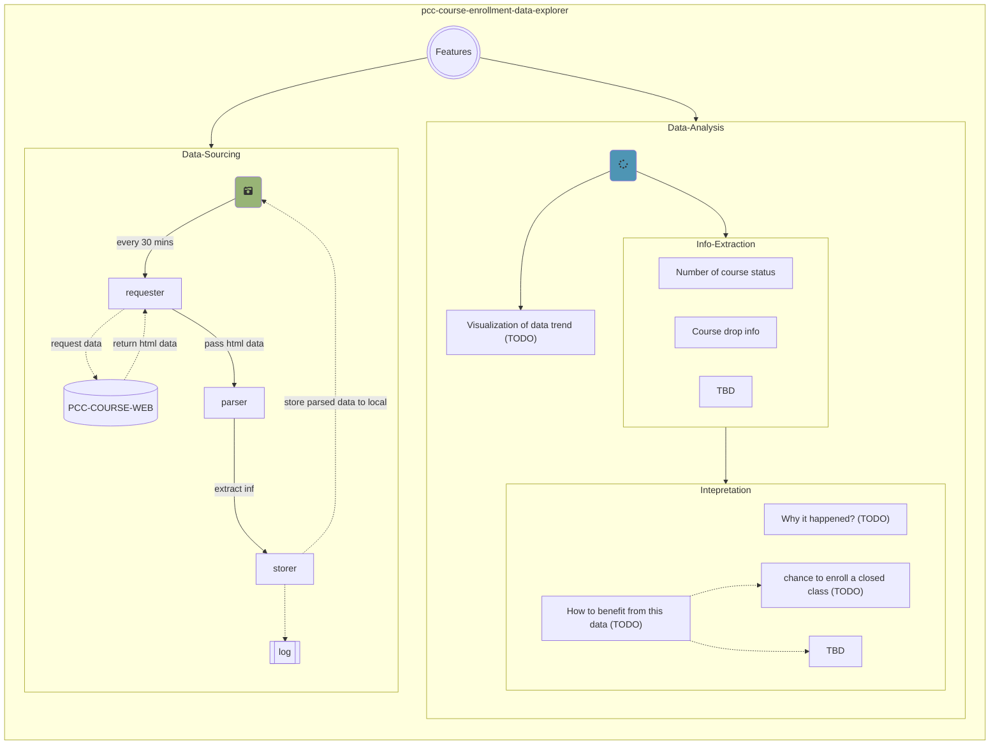

<!-- Header block for project -->
<hr>

<div align="center">

<span style="display:block;text-align:center">
  
  
  
</span>

  <h1 align="center">PCC Course Enrollment Data Explorer</h1>
  <!-- ☝️ Replace with your repo name ☝️ -->

</div>

<pre align="center">Discover the fun facts of PCC course enrollment data and give it a analysis.</pre>

<!-- Header block for project -->

[](https://github.com/perryzjc/sdlc-journey)[](https://nasa-ammos.github.io/slim/)



This project wanted to explore PCC's (Pasadena City College) course enrollment data, to learn interesting facts about it and try to give it an analysis and interpretation. For example, a course is likely to have a large number of students drop at a certain time due to students not paying tuition. Students can use this opportunity to enroll in this closed course. This project hopes to support this conjecture with a large data set and discover more data phenomena.

[PCC Data Science Website](https://lancerlife.pasadena.edu/organization/datascience) [PCC Course Schedule Website](https://ssb-prod.ec.pasadena.edu/PROD/pw_psearch_sched.p_search)

## Features

* Data Sourcing: Automatically captures and stores up-to-date information from the PCC Course Web every 30 minutes. This data is then parsed and extracted for further analysis.
  * Obtained course data is uploaded to the [output folder](https://github.com/perryzjc/pcc-course-enrollment-data-explorer/tree/main/output) by the server owned by [@perryzjc](https://github.com/perryzjc?tab=repositories) 
* Data Analysis: Provide a range of capabilities for analyzing the data, including:
  * Info Extraction: Extract and organize information such as the number of course statuses and course drop rates.
  * Interpretation: Provide context for the data by answering questions such as "Why did this happen?" and "How can this data be used to benefit the user?" Examples include identifying potential opportunities for enrolling in a closed class.
  * Visualization of Data Trends: Plan to provide clear visualization of data trend (TODO).

## Contents

* [Quick Start](#quick-start)
* [Changelog](#changelog)
* [FAQ](#frequently-asked-questions-faq)
* [Contributing Guide](#contributing)
* [License](#license)
* [Support](#support)

## Quick Start

This guide provides a quick way to get started with this project.

### Requirements

* [conda](https://docs.conda.io/projects/conda/en/latest/user-guide/install/index.html) to be installed on the machine where the project will be run. Please make sure to have conda installed before running the project.
  

### Setup Instructions

1. Clone this project repository via `git@github.com:perryzjc/pcc-course-enrollment-data-explorer.git`
   
1. Navigate to the directory where the repository is installed, i.e. pcc-course-enrollment-data-explorer
   
   `cd pcc-course-enrollment-data-explorer`
   
1. To create a suitable environment for running this project, I recommend using the `environment.yml` file with conda. This file contains all the necessary dependencies and can be easily created using the following command: 
   
   `conda env create -f environment.yml`

### Run Instructions

1. Once the environment is created, you can activate it by running the command

   `conda activate <environment_name>`. 

   Replace `<environment_name>` with the actual name of the environment, which can be found in the `environment.yml` file, the prompt given by your shell (after running the command `conda env create -f environment.yml`), or by running the command `conda info --envs`.

2. Run the code that you are interested in. For example,

   `python3 main.py`

### Usage Examples

```shell
(pcc-course-enrollment-data-explorer) perryzjc@MBP pcc-course-enrollment-data-explorer % python3 main.py
```

#### Expected results:

1.Course data are obtained every 30 minutes and are store to the location based on current time

   (assume current time 2023-01-09-23-03-08)

```
pcc-course-enrollment-data-explorer
  - data_analysis
  - data_sourcing
  - output
    - data_analysis
    - data_source
      - 2023
        - 01
          - 09
            - 2023-01-09-23-03-08.csv
    - log
      - log.txt
      - README.md
  - tests
  - environment.yml
  - main.py
  - ...
```

2. `log.txt` got updated. For example, a new line got added to the file `log.txt`: 

  `successfully store all course data as a csv file at time: 2023-01-09 23:03:08`

## Changelog

See our [CHANGELOG.md](https://github.com/perryzjc/pcc-course-enrollment-data-explorer/blob/main/CHANGELOG.md) for a history of our changes.

## Frequently Asked Questions (FAQ)

1. How to install conda and use it?
   - Please check the following resources which might are helpful
     - https://docs.conda.io/projects/conda/en/latest/user-guide/install/index.html
     - https://gist.github.com/atifraza/b1a92ae7c549dd011590209f188ed2a0
     - For solving `CommandNotFoundError`
       - https://stackoverflow.com/questions/28612500/why-anaconda-does-not-recognize-conda-command#:~:text=C%3A%5CUsers.-,For%20Linux,-You%20need%20to

## Contributing

Interested in contributing to this project? Please see our: [CONTRIBUTING.md](https://github.com/perryzjc/pcc-course-enrollment-data-explorer/blob/main/CONTRIBUTING.md)

1. Create an GitHub issue ticket describing what changes you need (e.g. issue-1)
2. [Fork](https://github.com/perryzjc/pcc-course-enrollment-data-explorer/fork) this repo
3. Make your modifications in your own fork
4. Make a pull-request in this repo with the code in your fork and tag the repo owner / largest contributor as a reviewer

**Working on your first pull request?** See guide: [How to Contribute to an Open Source Project on GitHub](https://kcd.im/pull-request)

For guidance on how to interact with our team, please see our code of conduct located at: [CODE_OF_CONDUCT.md](https://github.com/perryzjc/pcc-course-enrollment-data-explorer/blob/main/CODE_OF_CONDUCT.md)

## License

See our: [LICENSE](https://github.com/perryzjc/pcc-course-enrollment-data-explorer/blob/main/LICENSE)

## Support

[@perryzjc](https://github.com/perryzjc)
